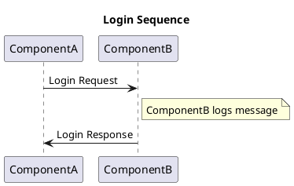
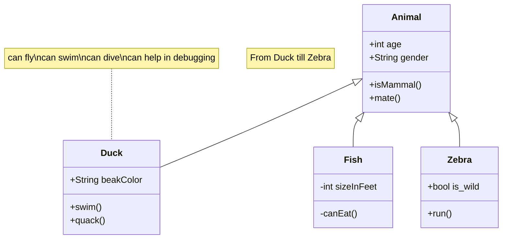
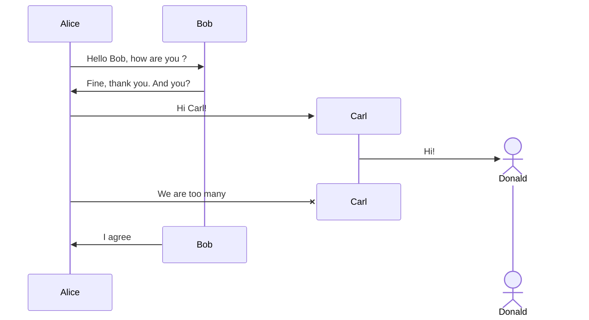

# Plugins & Extensions

Just by including the TechDocs Core Plugin to your MkDocs site included with Backstage,
you gain the immediate use of a variety of popular plugins and extensions to MkDocs.

For more information and full details of the available features, see the
[`mkdocs-techdocs-core` repository](https://github.com/backstage/mkdocs-techdocs-core#mkdocs-plugins-and-extensions).

This page provides a demonstration of some of the available features.


## Mkdocs material

### Tooltips

[Hover me]("I'm a tooltip!")

### Data Tables

| Method | Description |
| ------ | ----------- |
| `GET`    | :material-check: Fetch resource |
| `PUT`    | :material-check-all: Update resource |
| `DELETE` | :material-close: Delete resource |

| Method | Description           |
| -------- | ------------------- |
| `GET`    | # Fetch resource    |
| `PUT`    | ## Update resource  |
| `DELETE` | ### Delete resource |

| Method | Description |
| ------: | :----------- |
| `GET`    | Fetch resource |
| `PUT`    | Update resource |
| `DELETE` | Delete resource |


### Admonitions

Admonitions are call outs that help catch a users attention.

To define an admonition simply put the following Markdown into your content:

```
!!! warn
    Defining admonitions can be addicting.
```

And they end up looking like this:

<!-- prettier-ignore -->
!!! note
    Note: Lorem ipsum dolor sit amet, consectetur adipiscing elit. Nulla et euismod nulla. Curabitur feugiat, tortor non consequat finibus, justo purus auctor massa, nec semper lorem quam in massa.

<!-- prettier-ignore -->
!!! abstract
    Abstract: Lorem ipsum dolor sit amet, consectetur adipiscing elit. Nulla et euismod nulla. Curabitur feugiat, tortor non consequat finibus, justo purus auctor massa, nec semper lorem quam in massa.

<!-- prettier-ignore -->
!!! info
    Info: Lorem ipsum dolor sit amet, consectetur adipiscing elit. Nulla et euismod nulla. Curabitur feugiat, tortor non consequat finibus, justo purus auctor massa, nec semper lorem quam in massa.

<!-- prettier-ignore -->
!!! tip
    Tip: Lorem ipsum dolor sit amet, consectetur adipiscing elit. Nulla et euismod nulla. Curabitur feugiat, tortor non consequat finibus, justo purus auctor massa, nec semper lorem quam in massa.

<!-- prettier-ignore -->
!!! question
    Question: Lorem ipsum dolor sit amet, consectetur adipiscing elit. Nulla et euismod nulla. Curabitur feugiat, tortor non consequat finibus, justo purus auctor massa, nec semper lorem quam in massa.

<!-- prettier-ignore -->
!!! warning
    Warning: Lorem ipsum dolor sit amet, consectetur adipiscing elit. Nulla et euismod nulla. Curabitur feugiat, tortor non consequat finibus, justo purus auctor massa, nec semper lorem quam in massa.

<!-- prettier-ignore -->
!!! failure
    Failure: Lorem ipsum dolor sit amet, consectetur adipiscing elit. Nulla et euismod nulla. Curabitur feugiat, tortor non consequat finibus, justo purus auctor massa, nec semper lorem quam in massa.

<!-- prettier-ignore -->
!!! danger
    Danger: Lorem ipsum dolor sit amet, consectetur adipiscing elit. Nulla et euismod nulla. Curabitur feugiat, tortor non consequat finibus, justo purus auctor massa, nec semper lorem quam in massa.

<!-- prettier-ignore -->
!!! bug
    Bug: Lorem ipsum dolor sit amet, consectetur adipiscing elit. Nulla et euismod nulla. Curabitur feugiat, tortor non consequat finibus, justo purus auctor massa, nec semper lorem quam in massa.

<!-- prettier-ignore -->
!!! example
    Example: Lorem ipsum dolor sit amet, consectetur adipiscing elit. Nulla et euismod nulla. Curabitur feugiat, tortor non consequat finibus, justo purus auctor massa, nec semper lorem quam in massa.

<!-- prettier-ignore -->
!!! quote
    Quote: Lorem ipsum dolor sit amet, consectetur adipiscing elit. Nulla et euismod nulla. Curabitur feugiat, tortor non consequat finibus, justo purus auctor massa, nec semper lorem quam in massa.

## Pymdownx Extensions

Pymdownx (Python Markdown extensions) are a variety of smaller additions.

### Details

<!-- prettier-ignore -->
??? note "What is the answer to life, the universe, and everything? (click me for the answer)"
    The answer is 42.

<!-- prettier-ignore -->
??? note "What is 4 plus 4?"
    The answer is 8.

<!-- prettier-ignore -->
???+ note "How do I get support?"
    You can get support by opening an issue in this repository. This detail is open by default
    so it's more easily visible without requiring the user to click to open it.

??? multiple optional-class "Summary"
    Here's some content.

???+ note "Open styled details"

    ??? danger "Nested details!"
        And more content again.

??? success
    Content.

??? warning classes
    Content.

### Task Lists

Automatic rendering of Markdown task lists.
- [x] Phase 1
- [x] Phase 2
- [ ] Phase 3

- [X] item 1
 * [X] item A
 * [ ] item B
   + [x] item a
   + [ ] item b
   + [x] item c
   * [X] item C
- [ ] item 2
- [ ] item 3

### Emojis

Very nice job on documentation! :thumbsup:

I've read a lot of documentation, but I love :heart: this document.

Weather: :sunny: :umbrella: :cloud: :snowflake:

Animals: :tiger: :horse: :turtle: :wolf: :frog:

### Attributes

[A Download Link](./images/backstage-logo-cncf.svg){: download }

{: style="width: 50px" }

### Mark

==mark me==

### Tabbed

=== "Tab 1"
    Markdown **content**.

    Multiple paragraphs.

    start
    :Init Phase;
    :Transfer Phase;
    note right
    long running activity,
    process requires signal to proceed
    end note
    :Termination Phase;
    stop

=== "Tab 2"
    More Markdown **content**.

    - list item a
    - list item b

=== "Tab 3"
    Even more Markdown **content**.

    | **Data Plane** |  |  |  |  |  |  |
    | --- | --- | --- | --- | --- | --- | --- |
    | **DP Role** | Role | Description | **Can be granted for**   | Scope | Group Name | **How to grant Data Plane Role** |
    | bold | normal | normal | bold   | normal | normal | bold |

### PlantUml
Here is a plantuml schema!



### Mermaid

Here is a mermaid graph!

#### Graph


#### Class


#### Sequence
